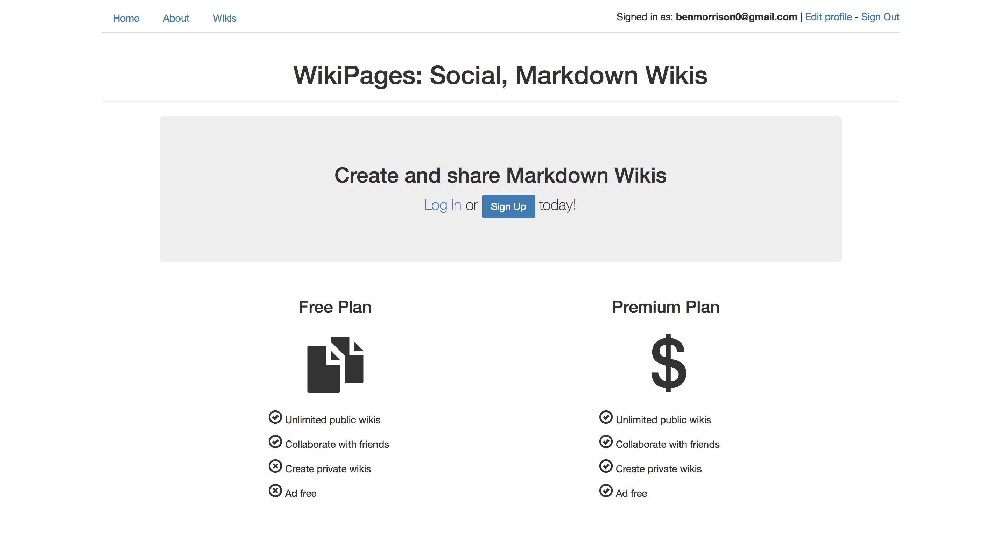

# WikiPages
## A markdown wiki site where you can collaborate with friends

WikiPages is a Ruby on Rails built wikipedia where anyone can make articles to collaborate with people. If desired, a user can upgrade to a premium account to make private wikis. This website was built with the **Devise**, **Stripe**, **RedCarpet**, and **Pundit** gems. It was tested with **RSpec**, **shoulda**, and **Faker**.

### Prerequisites

This project was built with `Ruby 2.3.1` and `Rails 4.2.5`. **Do not** use with Rails 5.

### Getting Started

In order to download and use or alter WikiPages locally, follow these steps:

1. Clone this repository
2. `cd` into your new `wiki-pages` directory
3. Run `bundle install`
4. Setup the database with `rake db:create`, `rake db:migrate`, and `rake db:seed`
5. **Optional**: Edit code to your liking
6. Run `rails s` and navigate to `localhost:3000` in your browser to start using!
